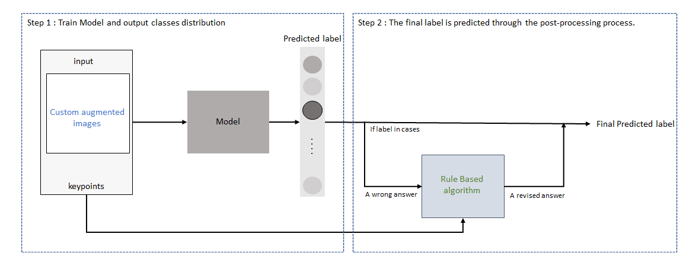
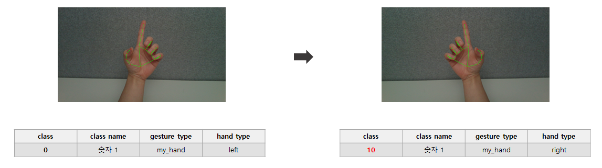
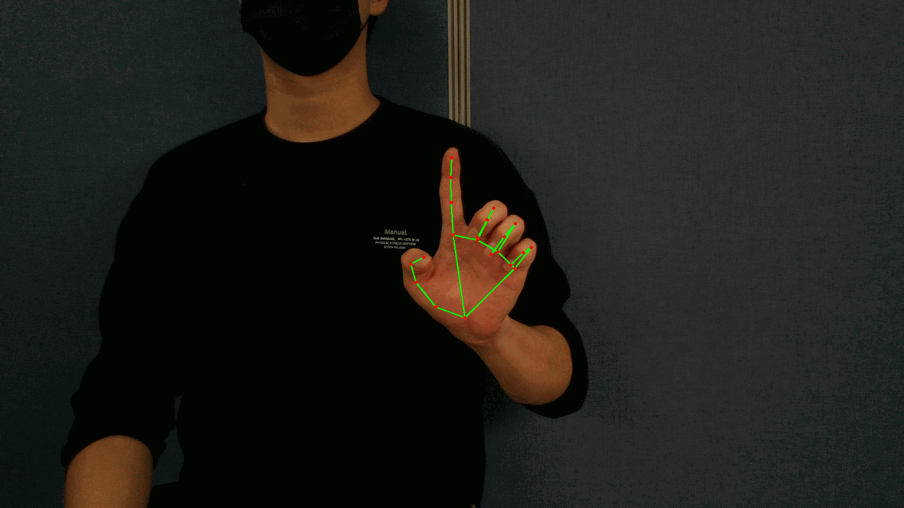
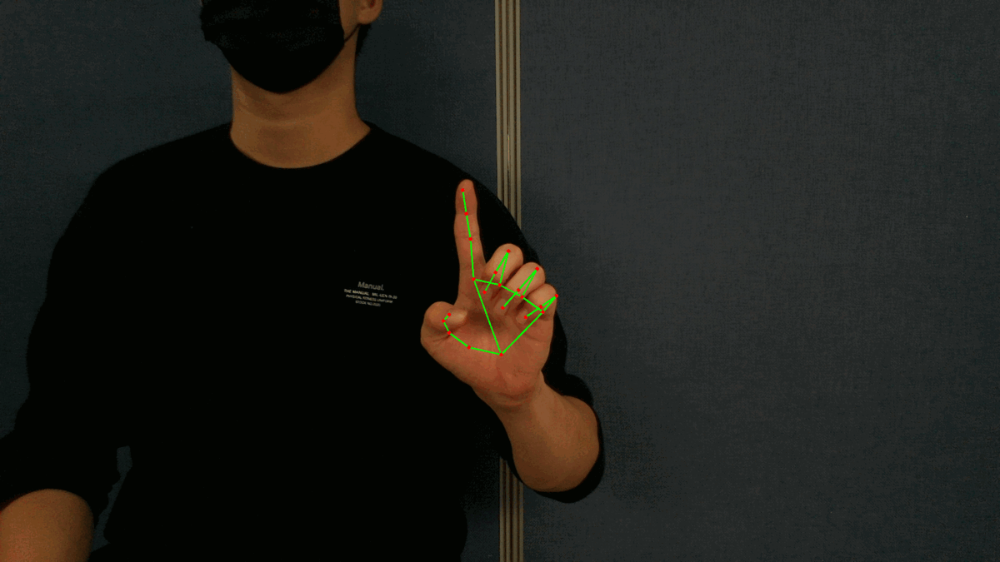
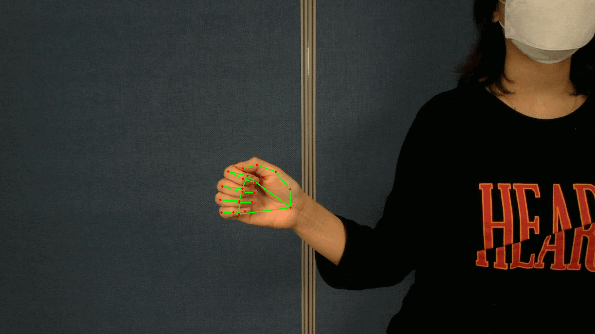

# Ego-Vision: hand motion recognition
## Introduction
This repository is the 1st place solution for [DACON Ego-Vision Hand Gesture Recognition AI Contest](https://dacon.io/competitions/official/235805/overview/description). We developed a hand motion classification model using continuous image data extracted from Ego-Vision video. The key strategies used are as follows: 
1. Custom augmentation is applied in consideration of data characteristics. 
2. Due to the problem caused by simply distinguishing dynamic Hand Movement into continuous but static images, the final predictions for some labels are determined by postprocessing algorithms.


This is the overall model process.
<div align="center"></div>

## Dataset description
- data is image extracted from first-person perspective, and for 157 classes, training data consists of a total 649 folders and 217 folders for test data. (The purpose the model is to predict the class of a certain folder, by looking at images within)
- 157 classes can be classified through ‘hand_type’ and ‘view_type’, (Left / Right)-handed and (First / Third)-view respectively.
- Additionally, key points of hand data containing coordinates (x, y, z) information are exploited in post-processing.

## Main strategy(Other training techniques are omitted.)
- Custom Data Augmentation
    - Random Crop using key points 
        - Most of images in a single folder are very similar with each others.
        - We applied random crop augmentation adopting probabilistic marginalizing based on key points so that hand positions are transformed differently.

    - Flip Augmentation
        - Horizontal flip augmentation has to be handled carefully because some assigned different classes depending on left or right-handed image even if the poses are the same.
        - We filtered out those classes and changed the class label if the augmentation is applied.
        - Experimental results showed the best result when it comes to apply flip augmentation on 0.3 ratio among the range of 0.1 to 0.5.
        <div align="center"></div>

- Post-Processing
    - Motivation
        - We found that the deviation of score per Fold was still severe even after appropriate Train/Valid Split.
        - Analysis was conducted on classes that the model performed weak prediction confidence.
        - As a result, the model predicted the certain classes with large log loss value out of whole class instances.
        - The class of the corresponding image is case1: (number 1, negative), case2: (warning, fist clenching).
        - Since each case is a very similar image, it is difficult to distinguish the class by looking at each image, but the class can be distinguished by calculating finger movement of images within a folder using the keypoint value.

    - A Rule-based Approach using Key points<div>

        case1 : Class "Number 1“ & “Negative Sign (Waving Index Finger)”<div>
        Image stream of a folder showed that the class "Number 1“ maintained overall position of the hand, however the movement of index finger is observed in the case of “Negative” class.<div>

        details :
        - Using the amount of maximum difference observed in the change from the index finger, thresholding is processed to make a decision between class "Number 1“ and class “Negative Sign”.
        - The key point on the index finger has the smallest coordinate on the Y-axis among several key points.
        - Predictions were performed by calculating the amount of change of the corresponding key point to the X-axis.
        <table style="display: inline-table;">  
        <tr><td></td><td></td></tr>
        <tr><td><div align="center">1. 숫자1</td> <td><div align="center">2. 부정(검지흔들기)</td></tr></table><div>

        ***

        case2 : Class "Clenching Fist“ & “Sticking out one’s Fist"<div>
        Image stream of a folder showed that the class “Clenching Fist“ maintained overall position of the hand, however the movement of hand itself get closer toward camera in the case of "Sticking out one’s Fist“ class.<div>

        details :
        - Class “Clenching Fist” and “Sticking out one’s Fist” can be specified with a change in position from certain key point.
        - Applied thresholding on the certain point that has the maximum amount of change in the X-axis.
        - The maximum change of any key point from Class “Clenching Fist” is the threshold of the decision boundary.
        <table style="display: inline-table;">  
        <tr><td></td><td></td></tr>
        <tr><td><div align="center">1. 주먹 쥐기</td> <td><div align="center">2. 주먹 내밀기</td></tr></table>

    

    --> The thresholds of each case are decided from train dataset and applied the same on inference step.


## Results(LogLoss)
The base model used RegNety040, ResNet50, and EfficientNet_b3. Among them, regny040 recorded the highest score and selected the 5fold ensemble model as the final model.
The logloss according to the presence or absence of post-processing is as follows:

W/O Post-Processing : 0.107  

W/ Post-Processing : 0.0578

## Conclusion
Even before participating in this competition, I participated in various compositions, including Daycon, focusing on applying models or training techniques.
With this competition, it was a competition where I could feel the importance of analyzing and looking at the data once again.

*** 


## Requirements
- Ubuntu 18.04, Cuda 11.1
- opencv-python  
- numpy  
- pandas
- timm
- torch==1.8.0 torchvision 0.9.0 with cuda 11.1
- natsort
- scikit-learn==1.0.0
- pillow
- torch_optimizer
- tqdm
- ptflops
- easydict
- matplotlib

```python
pip install -r requirements.txt
```

## Make dataset
```python
python make_data.py
```

## Train
```python
#1 Single Model Train
python main.py --img_size=288 --exp_num=0

#2 Multiple training using shell
sh multi_train.sh
```

## Make a prediction with post-processing
```python
# Pretrained weight download from github
os.makedirs('./results/', exist_ok=True)
!wget -i https://raw.githubusercontent.com/wooseok-shin/Egovision-1st-place-solution/main/load_pretrained.txt -P results
```

```python
python test_post_processing.py
```


